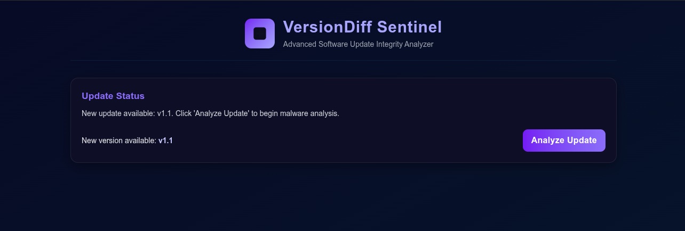
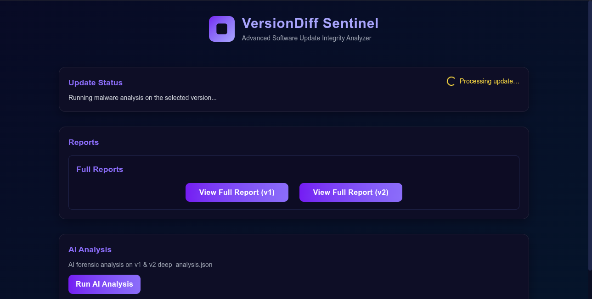
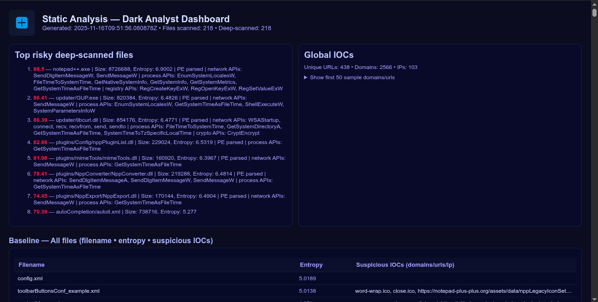
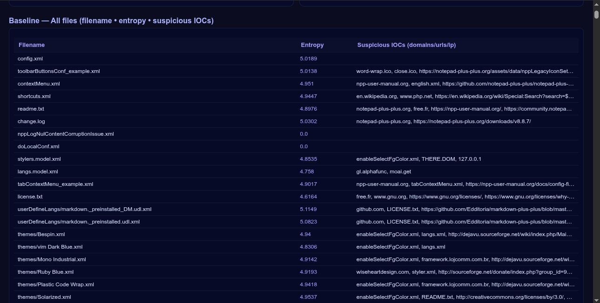
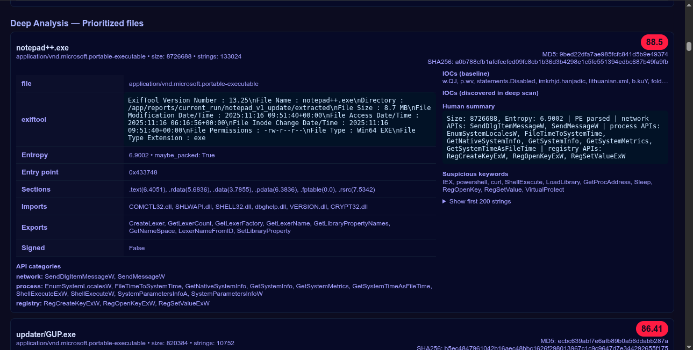
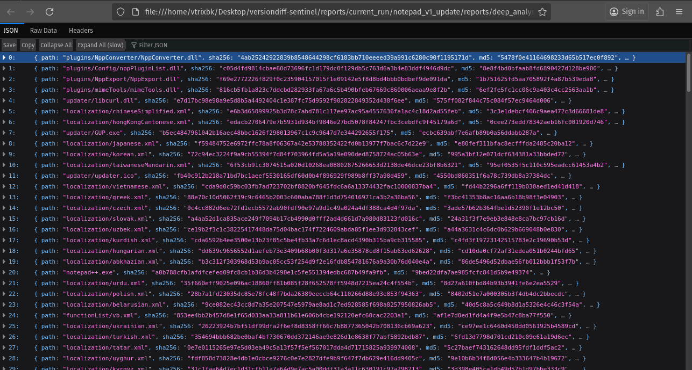
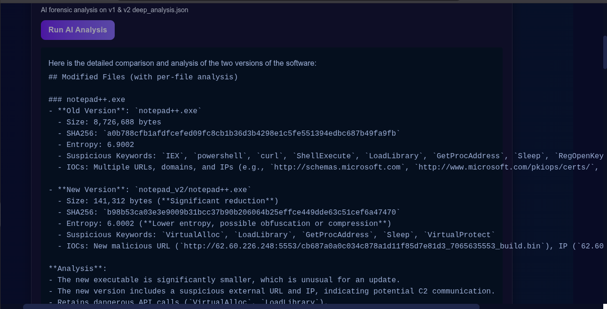

# VersionDiff Sentinel

**VersionDiff Sentinel** is an advanced **software update integrity analyzer** that performs full static and differential malware analysis on software update packages (ZIPs).  
It simulates update checks, performs multi-phase static analysis, and generates AI-assisted forensic reports comparing software versions.

---

## Features

### **Update Monitoring**
- Automatically checks for new software versions  
- Displays real-time update status  
- Runs deep analysis on update packages  

### **Version Comparison (v1 vs v2)**
- Compares update artifacts  
- Generates full HTML reports for each version  
- Highlights modified files, added files, deleted files, behavioral changes  

### **AI-Driven Forensic Analysis**
- Processes `deep_analysis.json` from both versions  
- Uses AI to summarize:
  - Suspicious changes  
  - Behavioral red flags  
  - Security-impacting differences  
  - Overall risk rating  

### **Dashboard-Style Interface**
- Clean modern UI  
- Responsive layout  
- Dark theme  
- Tailwind + custom CSS  

---

## Tech Stack

**Frontend:**  
- React  
- Vite  
- TailwindCSS  
- Framer Motion  
- React Markdown  

**Backend:**  
- Python  
- Flask / FastAPI (depending on your implementation)  
- File-based reporting system  


## Running with Docker

```bash
# Clone repo
git clone https://github.com/abhinavbibek/versiondiff-sentinel.git
cd versiondiff-sentinel

# Copy and configure environment
cp .env.example .env
nano .env

# Build and run
docker compose up --build

# Access the web UI
http://localhost:8000

```

| Endpoint                    | Method | Description                       |
| --------------------------- | ------ | --------------------------------- |
| `/api/check_update`         | GET    | Check simulation state            |
| `/api/apply_update`         | POST   | Apply update and trigger analysis |
| `/api/analyze`              | POST   | Manual analysis of two ZIPs       |
| `/api/ai_analyze`           | POST   | LLM forensic summary              |
| `/api/progress/{run_id}`    | GET    | Current analysis progress         |
| `/api/reports/{report_dir}` | GET    | View HTML or JSON report          |
| `/ws/progress/{run_id}`     | WS     | Real-time progress updates        |

## AI Analysis Workflow
- After both ZIPs analyzed → user clicks Perform AI Analysis
- Server merges baseline_inventory.json + deep_analysis.json
- Sends structured diff to Gemini via API
- Receives Markdown forensic summary
- Saves as ai_report.md in report directory


## Each analysis produces:
```bash
reports/
└── v1_update/
    ├── baseline_inventory.json
    ├── deep_analysis.json
    └── full_report.html
└── v2_update/
    ├── baseline_inventory.json
    ├── deep_analysis.json
    └── full_report.html
```

## AI reports output:
```
ai_report.md
```


## Screenshots

### Update Detection 
<br/><br/>

### Analysis in Progress
<br/><br/>

### Static Analysis — Dark Analyst Dashboard 
<br/><br/>

### Baseline Summary (Entropy + IOCs)
<br/><br/>

### Deep Analysis — Prioritized Files (Executable Scan)
<br/><br/>

### Raw JSON Inventory (deep_analysis.json)
<br/><br/>

### AI Forensic Report (Markdown Output)


